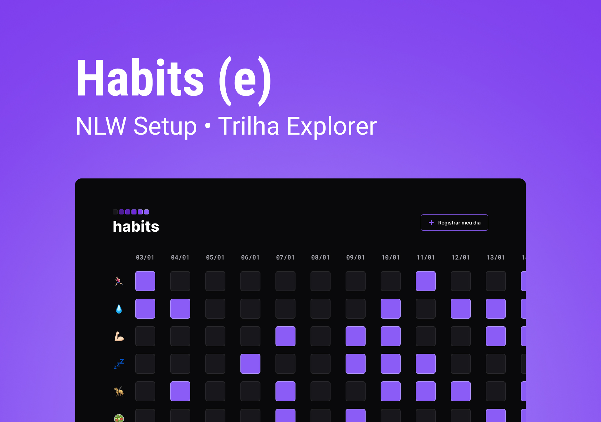

<h1 align="center"> Habits </h1>

Programa criado seguindo o passo a passo visto na NLW, evento totalmente gratuito promovido pela Rocketseat

 
 

## 👨‍🚀🚀 Tecnologias Utilizadas no projeto

Este projeto foi desenvolvido com as seguintes tecnologias:

- HTML e CSS
- JavaScript
- Git e GitHub
- Figma

## 💻 Projeto

O Habits é um app criado com o intuito de  ajudar a rastrear os hábitos diários.

- [Visite o projeto online] (https://jottapedev.github.io/nlw-setup/)

## 🔚
